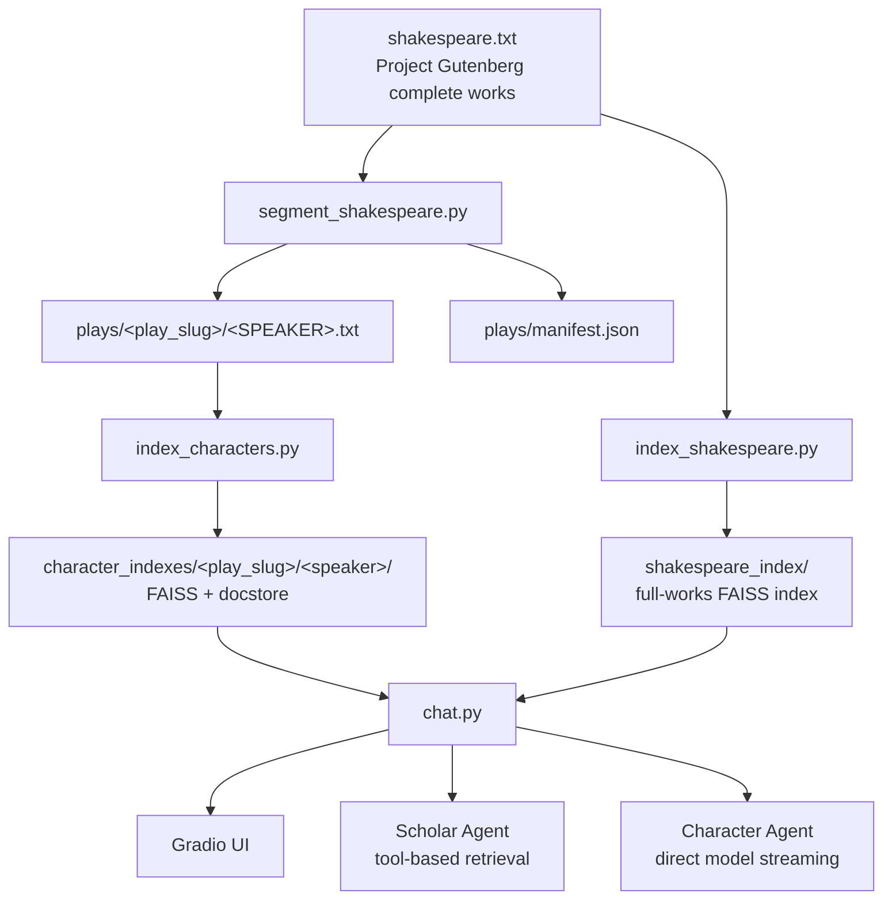

# 🎭 Shakespeare RAG Agent Demo

A Gradio chat app that lets you:
1. **Ask a Scholar** — factual questions about Shakespeare's complete works via a LangChain tool agent with retrieval
2. **Speak with any Character** — chat with any speaker from any play (Hamlet, Lady Macbeth, Falstaff, etc.) grounded in their actual lines

Built for a RAG / FAISS / LangChain interview demo.

---

## Architecture Overview



---

## Data Pipeline: From Raw Text to Character Indexes

### 1. Play Segmentation (`segment_shakespeare.py`)

The complete works is one 5.5 MB text file. We extract individual plays using **regex on the table of contents**:

- Parse the TOC to get the ordered list of 44 works
- For each title, find its actual start in the body text (`^TITLE$` with `re.MULTILINE` — the TOC entries are indented, the real headers are not)
- Slice content between consecutive play headers

### 2. Speaker Parsing

Inside each play, dialogue follows a rigid format:

```text
HAMLET.
Seems, madam! Nay, it is; I know not seems.
'Tis not alone my inky cloak, good mother,
...

QUEEN.
If it be,
Why seems it so particular with thee?
```

We extract speaker blocks with the regex:
```python
r"^([A-Z][A-Z\s',]+)\.\n(.*?)(?=\n[A-Z][A-Z\s',]+\.\n|\Z)"
```

**Cleanup steps:**
- Strip redundant speaker prefixes (the filename already tells us who it is)
- Remove stage directions: `re.sub(r"\[_[^\]]+_\]", "", text)`
- Filter out fake "speakers" like `SCENE`, `ACT`, `ENTER`, `EXIT`
- Drop bit-part actors with < 100 characters of dialogue

### 3. Per-Character FAISS Indexing (`index_characters.py`)

For each play, for each speaker with sufficient dialogue:
1. Read the speaker's `.txt` file
2. Chunk with `RecursiveCharacterTextSplitter(chunk_size=800, chunk_overlap=80)`
3. Embed with `OllamaEmbeddings(model="nomic-embed-text-v2-moe:latest")`
4. Build a **dedicated `FAISS` index for that character** and save to `character_indexes/<play_slug>/<speaker>/`

Result: **~1,200 character-specific indexes**. When you chat with Hamlet, you search *Hamlet's own index* — not a play-wide index with post-hoc filtering.

---

## Agent Design

### 📚 Scholar Agent (Tool Agent)

- **Model:** `ChatOpenAI` pointing to LM Studio (`unsloth/Qwen3.6-35B-A3B-GGUF:Q8_0`)
- **Tool:** `retrieve_shakespeare` → similarity search on the full `shakespeare_index` (3,161 chunks)
- **Framework:** `create_agent` from `langchain.agents` with `system_prompt`
- **Streaming:** `agent.astream(..., stream_mode="messages")` yields `(AIMessageChunk, metadata)` tuples
  - We filter out empty `content=''` chunks (the model emits hundreds of them)
  - `tool_call_chunks` → show pending 🔍 accordion
  - `ToolMessage` → show retrieved 📚 context accordion
  - Non-empty `AIMessageChunk.content` → stream tokens live into the assistant message

### 🎭 Character Agent (Direct Streaming)

No compiled agent graph here — we stream directly from the model:

1. User picks a **play** and a **character**
2. Load that character's **dedicated FAISS index**: `character_indexes/<play>/<speaker>/`
3. `store.similarity_search(query, k=4)` → retrieve only that character's lines
4. Build a system prompt with the character's own words as grounding context
5. `model.astream(messages)` → real token streaming into Gradio

This avoids the buffering issue we hit with `create_agent` + `dynamic_prompt` middleware, and retrieval is precise because every character has their own embedded index.

---

## Key Technical Learnings

### Streaming is not obvious in LangGraph / LangChain

The "correct" pattern for `stream_mode="messages"` (discovered through REPL debugging):

```python
for chunk, metadata in agent.astream(input, stream_mode="messages"):
    if isinstance(chunk, AIMessageChunk) and chunk.content:
        print(chunk.content, end="", flush=True)
```

- Most `AIMessageChunk` objects have `content=''` — only some carry actual tokens
- Tool calls appear as chunks with `tool_call_chunks` populated
- `ToolMessage` chunks carry the tool result
- `finish_reason: 'tool_calls'` or `'stop'` appears in `response_metadata`

### Gradio 6.x ChatMessage API

- No `type="messages"` parameter — just pass `ChatMessage` objects directly
- To update a message in-place, replace the entire `ChatMessage` object in the list:
  ```python
  history[-1] = ChatMessage(role="assistant", content=new_text)
  yield history
  ```
- `metadata={"title": "...", "status": "pending" | "done"}` renders collapsible accordions

### Per-character indexes vs. play-wide + filter

We started with one index per play and filtered results by speaker in Python. That works, but it's a hack — you're retrieving from a mixed corpus and throwing away most results. Building **one index per character** (~1,200 total) is the cleaner pattern: each embedding space contains only that character's voice, so retrieval is precise and the vector math isn't polluted by other speakers' dialogue.

---

## File Reference

| File | Purpose |
|------|---------|
| `segment_shakespeare.py` | Regex-based play + speaker extraction |
| `index_characters.py` | Builds per-character FAISS indexes |
| `index_shakespeare.py` | Original full-works indexer (used by Scholar agent) |
| `chat.py` | Gradio app with scholar + character chat |
| `test_character_chat.py` | Standalone CLI test for character streaming |
| `agent.py` | Standalone CLI test for tool + middleware agents |
| `shakespeare.txt` | Raw Gutenberg complete works (~5.5 MB) |
| `plays/` | 44 directories, one per play, containing `<SPEAKER>.txt` files |
| `character_indexes/` | ~1,200 FAISS indexes (one per character) |
| `shakespeare_index/` | Full-works FAISS index (3,161 chunks) |

---

## Running Locally

```bash
# 1. Install deps
uv sync

# 2. Build character indexes (one-time)
uv run python segment_shakespeare.py
uv run python index_characters.py

# 3. Launch Gradio app
uv run python chat.py
# → http://localhost:7860
```

Requires:
- Ollama running locally with `nomic-embed-text-v2-moe:latest` for embeddings
- LM Studio (or any OpenAI-compatible endpoint) running with your model for generation
- `KIMI_API_KEY` and `KIMI_BASE_URL` env vars (or edit `chat.py` to point at your local endpoint)

---

## Demo Script Ideas

1. **Scholar:** "What does Hamlet say about death?" → watch the tool call retrieve passages, then see the scholarly answer with quotes
2. **Character (Hamlet):** "What do you think of your mother marrying your uncle?" → Hamlet responds in his own voice, grounded in his actual soliloquies
3. **Character (Lady Macbeth):** "Tell me about your ambition" → switch play to Macbeth, character to LADY MACBETH
4. **Cross-play comparison:** Ask the Scholar about Romeo vs. Hamlet's views on love, then ask each character directly
